<style>
  .col2 {
    columns: 2 200px;         /* number of columns and width in pixels*/
    -webkit-columns: 2 200px; /* chrome, safari */
    -moz-columns: 2 200px;    /* firefox */
  }
</style>


```{r setup, include=FALSE}
knitr::opts_chunk$set(echo = FALSE)
```

A Raspberry Pi with NoIR camera can be used to measure photosynthesis in plants. Photosynthesis uses energy from sunlight to combine carbon dioxide (CO<sub>2</sub>) and water (H<sub>2</sub>O) to form carbohydrates. Oxygen (O<sub>2</sub>) is released as a byproduct. This process is part of the carbon cycle. 

<center></center>   

---

The infrared block filter has been removed from the NoIR camera, then a filter to block red light added. This allows the "red" channel of the camera to instead measure near-infrared light. https://www.raspberrypi.org/blog/whats-that-blue-thing-doing-here/  

<center>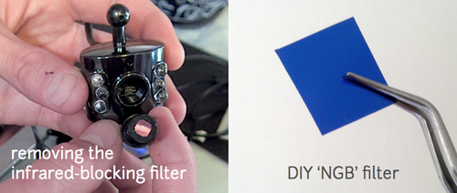 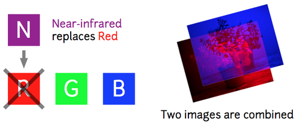 </center>

---

## Normalized Difference Vegetation Index (NDVI)
Photos from the NOIR camera with red block filter can be processed into false-colored *Normalized Difference Vegetation Index* (NDVI) images using a free online tool, Infragram by Public Lab. https://publiclab.org/wiki/infragram 

<center></center>  
   
---

The NVDI ratio normalizes for the brightness of the sunlight on the plant. https://publiclab.org/wiki/ndvi 

<center>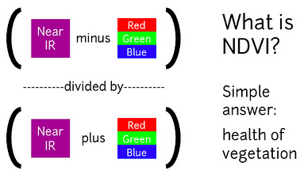

figure from research by Chris Fastie https://publiclab.org/wiki/ndvi-plots-ir-kit</center> 

---

Since chlorophyll absorbs blue and red light, but not green or infrared. The difference in red light absorption and near infrared reflectance indicates the amount of photosynthesis. 

<center>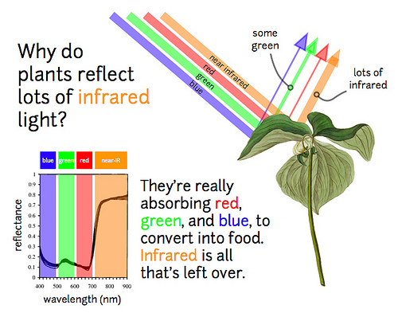</center>   

---

# Plant Photosynthesis - Part of the (Fast) Carbon Cycle
Carbon moves between land, atmosphere, and oceans in billions of tons per year.    
- yellow numbers are natural fluxes    
- red are human contributions    
- white indicate stored carbon    
Note this diagram does not account for volcanic and tectonic activity, which also sequesters and releases carbon. https://en.wikipedia.org/wiki/Carbon_cycle

<center>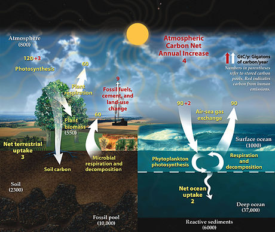</center>   

---

## Photosynthesis
There are several different types of photosynthesis which occur in different types of plants and depending on the environmental conditions.

### Calvin cycle - C<sub>3</sub> Photosynthesis
CO<sub>2</sub> is added to a phosphorylated 5-carbon sugar, ribulose biphosphate. This reaction is catalyzed by the enzyme *ribulose biphosphate carboxylase oxygenase* (RUBISCO). The resulting 6-carbon compound breaks down into 2 molecules of 3-phosphoglyceric acid (PGA). These are used to produce gulcose and other food.

### Photorespiration - C<sub>2</sub> Photosynthesis
RUBISCO can also add O<sub>2</sub> to ribulose biphosphate liberating CO2 in the process. High light intensities and high ]temperatures (above ~ 30 C) favor this process over photosynthesis. Photorespiration may be necessary for the assimilation of nitrate from soil.

### C<sub>4</sub> Photosynthesis
In mesophyll cells of C<sub>4</sub> plants CO<sub>2</sub> is added to 3-carbon phosphoenolpyruvic acid (PEP) to form 4-carbon oxaloacetic acid (C<sub>4</sub>).This is converted to malic or aspartic acid and tranported into a bundle sheath cell. These cells are often deep in the leaf with low levels of oxygen. In the sheath cells the 4-carbon acids are broken down into CO2 which enters the Calvin cycle or pyruvic acid which is transported back to a mesophyll cell where it is converted back into PEP.   

<center>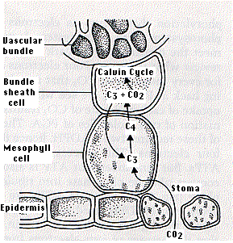</center>   

 * *crassulacean acid metabolism* (CAM) plants segregate C<sub>4</sub> and C<sub>3</sub> pathways in time
 - at night they take in CO<sub>2</sub> through their stomata and produce malic acid
 - in the morning stomata close and malic acid is broken down to release CO<sub>2</sub> to the Calvin (C<sub>3</sub>) cycle
 - cacti, Bryophyllum, pineapple, sedums, "ice plant" are well adapted to high temperatures and sunlight and low moisture
 * other plants segregate these pathways in different parts of the leaf
 - tobacco has C<sub>4</sub> cells near veins

---

## Transpiration through stomata
Transpiration is the process of water movement through a plant and its evaporation from aerial parts, such as leaves, stems and flowers. Water is necessary for plants but only a small amount of water taken up by the roots is used for growth and metabolism. The remaining 97-99.5% is lost by transpiration and guttation.
https://en.wikipedia.org/wiki/Transpiration

<center>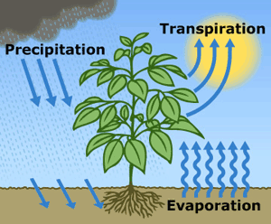 
<small> http://www.salinitymanagement.org/Salinity%20Management%20Guide/ew/ew_2.html </small> </center>

---

### Stomata (Greek stóma mouth)
Guard cells occur in pairs with a gap between them that forms a stomatal pore. The stomatal pores are largest when water is freely available and the guard cells turgid, and closed when water availability is critically low and the guard cells become flaccid. Guard cells perceive and process environmental and endogenous stimuli such as light, humidity, CO2 concentration, temperature, drought, and plant hormones to trigger cellular responses resulting in stomatal opening or closure. https://en.wikipedia.org/wiki/Guard_cell

<center>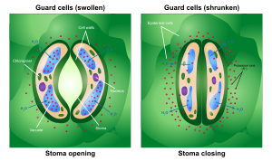</center>  

Photosynthesis depends on the diffusion of Carbon dioxide (CO<sub>2</sub>) from the air through the stomata into the mesophyll tissues. Oxygen (O<sub>2</sub>), produced as a byproduct of photosynthesis, exits the plant via the stomata. When the stomata are open, water is lost by evaporation and must be replaced via the transpiration stream, with water taken up by the roots. Plants must balance the amount of CO<sub>2</sub> absorbed from the air with the water loss through the stomatal pores, and this is achieved by both active and passive control of guard cell turgor and stomatal pore size. 

---

# Project Materials  

<div class="col2">
## Hardware
Raspberry Pi 5MP 1080P Camera NoIR (No IR Filter) $30   
3D printed camera case <small> http://www.thingiverse.com/thing:427546 </small> 
CanaKit Raspberry Pi B+ Complete Starter Kit $63   
- Raspberry Pi B+   
- Wifi Dongle   
- 8GB SD Card   
- Case   
- Power Supply   

## Software   
python-picamera <small> https://www.raspberrypi.org/documentation/usage/camera/python </small>    
infrapix <small> https://github.com/p-v-o-s/infrapix </small>  
sunwait <small> http://www.risacher.org/sunwait/ </small>   
cron  
<br>
<br>
<br>
<br>

</div>

---

## Photos
### 7:00 AM     

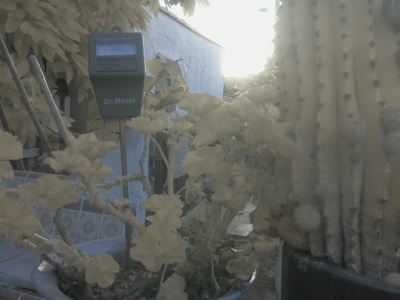 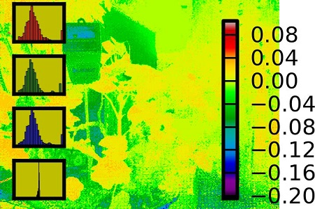

### 12:00 noon 

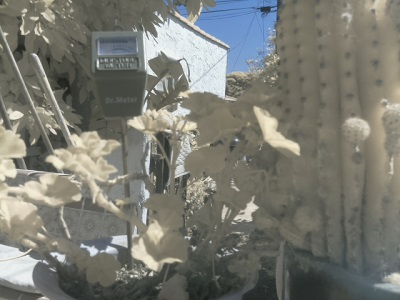 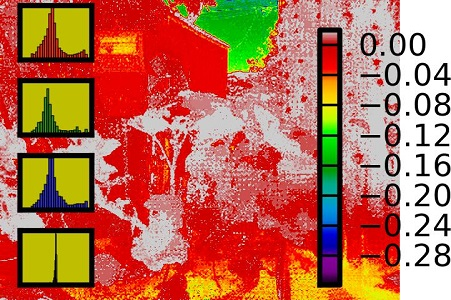 

### 5:00 PM  

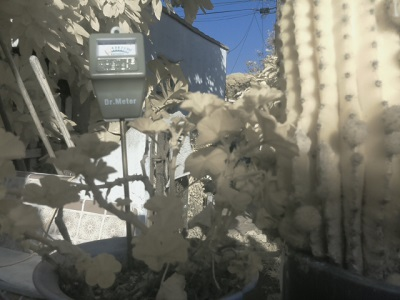 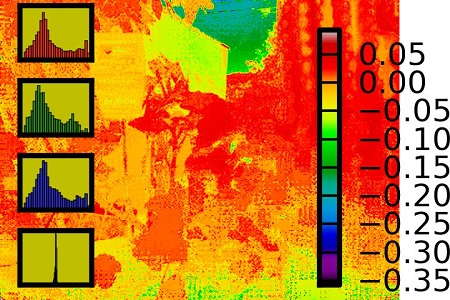

---

<!--## References
http://pub.epsilon.slu.se/12812/1/matrosova_a_151113.pdf -->

This work is licensed under a Creative Commons Attribution-ShareAlike 3.0 Unported License, https://creativecommons.org/licenses/by-sa/3.0/. Read more about Public Lab's open source licensing at https://publiclab.org/licenses.
