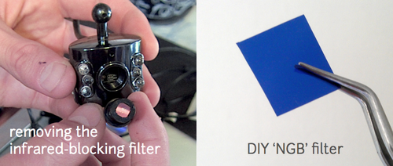
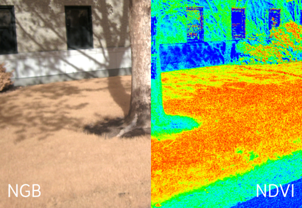
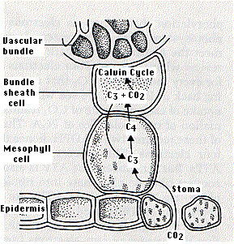

NoIR Plant Photosynthesis Measurement
================

A Raspberry Pi with NoIR camera can be used to measure photosynthesis in plants. The infrared block filter (NoIR) has been removed from the camera. Adding a filter to block red light, allows the "red" channel of the camera to instead measure near-infrared light. Since chlorophyll absorbs blue and red light, but not green or infrared. The difference in red light absorption and near infrared reflectance indicates the amount of photosynthesis. Photos from the NOIR camera with red block filter can be processed into false-colored *Normalized Difference Vegetation Index* (NDVI) images using a free online tool, Infragram by Public Lab. <https://publiclab.org/wiki/infragram>

Raspberry Pi and NoIR camera
----------------------------

<https://www.raspberrypi.org/blog/whats-that-blue-thing-doing-here/>

Normalized Difference Vegetation Index
--------------------------------------

<https://publiclab.org/wiki/ndvi>

Photosynthesis
--------------

Plant photosynthesis is part of the carbon cycle. Plants use energy from sunlight to combine carbon dioxide (CO2) and water (H2O) to form carbohydrates. Oxygen (O2) is released as a byproduct.

This diagram of the fast carbon cycle shows the movement of carbon between land, atmosphere, and oceans in billions of tons per year. Yellow numbers are natural fluxes, red are human contributions, white indicate stored carbon. Note this diagram does not account for volcanic and tectonic activity, which also sequesters and releases carbon. <https://en.wikipedia.org/wiki/Carbon_cycle>

### Calvin cycle - C3 pathway

CO2 is added to a phosphorylated 5-carbon sugar, ribulose biphosphate. This reaction is catalyzed by the enzyme ribulose biphosphate carboxylase oxygenase (RuBisCO). The resulting 6-carbon compound breaks down into 2 molecules of 3-phosphoglyceric acid (PGA). These are used to produce gulcose and other food.

### Photorespiration - C2 cycle

RuBisCO can also add O2 to ribulose biphosphate liberating CO2 in the process. High light intensities and high temperatures (above ~ 30 C) favor this process over photosynthesis.

### C4 plants

C4 plants minimize water loss to transpiration. In mesophyll cells of C4 plants CO2 is added to 3-carbon phosphoenolpyruvic acid (PEP) to form 4-carbon oxaloacetic acid (C4). This is converted to malic or aspartic acid and tranported into a bundle sheath cell. These cells are often deep in the leaf with low levels of oxygen. In the sheath cells the 4-carbon acids are broken down into CO2 which enters the Calvin cycle or pyruvic acid which is transported back to a mesophyll cell where it is converted back into PEP.

-   crassulacean acid metabolism (CAM) plants segregate C4 and C3 pathways in time
-   at night they take in CO2 through their stomata and produce malic acid
-   in the morning stomata close and malic acid is broken down to release CO2 to the Calvin (C3) cycle
-   cacti, Bryophyllum, pineapple, sedums, "ice plant" are well adapted to high temperatures and sunlight and low moisture
-   other plants segregate these pathways in different parts of the leaf
-   tobacco has C4 cells near veins

Results
-------
